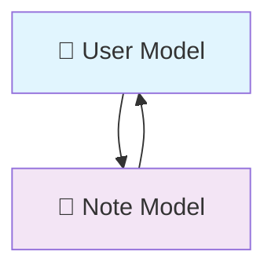
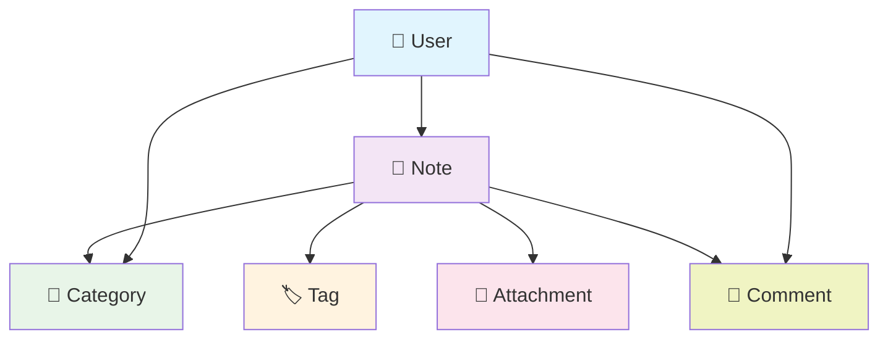

# 📋 Branch 03: Laravel Models


## 🎯 Overview

Welcome to the **Models Branch** - where data meets elegance! This branch demonstrates Laravel's powerful **Eloquent ORM** through a clean, focused notes application. Here you'll discover how to transform simple database tables into intelligent, expressive PHP objects.

> 💡 **Models are the backbone**: They're not just data containers - they're the living, breathing entities that give your application its personality and power!

---

## 🧬 What are Laravel Models?

<table>
<tr>
<td width="50%">

### 🎭 **Your Data's Best Friend**

Laravel Models are **Eloquent ORM** classes that:

- 🗃️ **Represent Database Tables** as PHP objects
- 🔍 **Query Builder Integration** for elegant database operations
- 🛡️ **Mass Assignment Protection** for security
- 🎯 **Attribute Casting** for proper data types
- 🚀 **Relationships** to connect related data
- 📊 **Accessors & Mutators** for data transformation

</td>
<td width="50%">

### ⚡ **Eloquent in Action**

```php
// Create a new note
$note = Note::create([
    'title' => 'My First Note',
    'content' => 'This is amazing!',
    'user_id' => auth()->id()
]);

// Find and update
$note = Note::find(1);
$note->update(['title' => 'Updated Title']);

// Query with relationships
$notes = Note::with('user')
            ->latest()
            ->get();
```

</td>
</tr>
</table>

---

## 🏛️ **Current Project Architecture**

### 🎨 **Simple & Clean Structure**

<div align="center">



*Current: User ↔ Note relationship*

</div>

---

## 🎪 **Core Models Implementation**

### 📝 **Note Model - The Heart of the App**

```php
<?php

namespace App\Models;

use Illuminate\Database\Eloquent\Factories\HasFactory;
use Illuminate\Database\Eloquent\Model;
use Illuminate\Database\Eloquent\Relations\BelongsTo;
use Carbon\Carbon;

class Note extends Model
{
    use HasFactory;

    /**
     * 🛡️ Mass Assignment Protection
     */
    protected $fillable = [
        'title',
        'content',
        'user_id',
    ];

    /**
     * 🎯 Attribute Casting
     */
    protected $casts = [
        'created_at' => 'datetime',
        'updated_at' => 'datetime',
    ];

    /**
     * 👤 Relationship: Note belongs to User
     */
    public function user(): BelongsTo
    {
        return $this->belongsTo(User::class);
    }

    /**
     * 🔍 Scope: Search notes by title or content
     */
    public function scopeSearch($query, $term)
    {
        return $query->where('title', 'like', "%{$term}%")
                    ->orWhere('content', 'like', "%{$term}%");
    }

    /**
     * 🔍 Scope: Get recent notes
     */
    public function scopeRecent($query, $days = 7)
    {
        return $query->where('created_at', '>=', now()->subDays($days));
    }

    /**
     * 📊 Accessor: Get content excerpt
     */
    public function getExcerptAttribute()
    {
        return \Str::limit(strip_tags($this->content), 150);
    }

    /**
     * 📊 Accessor: Get reading time estimate
     */
    public function getReadingTimeAttribute()
    {
        $wordCount = str_word_count(strip_tags($this->content));
        $minutes = ceil($wordCount / 200); // Average reading speed
        return $minutes . ' min read';
    }

    /**
     * 📊 Accessor: Get formatted creation date
     */
    public function getCreatedAtHumanAttribute()
    {
        return $this->created_at->diffForHumans();
    }

    /**
     * 🎯 Mutator: Clean and format title
     */
    public function setTitleAttribute($value)
    {
        $this->attributes['title'] = ucfirst(trim($value));
    }

    /**
     * 🎯 Mutator: Clean content
     */
    public function setContentAttribute($value)
    {
        $this->attributes['content'] = trim($value);
    }
}
```

<details>
<summary><strong>✨ Why this Note model rocks!</strong></summary>

- 🛡️ **Secure**: Mass assignment protection with `$fillable`
- 🎯 **Smart**: Automatic data casting and formatting
- 🔍 **Searchable**: Built-in search functionality
- 📊 **Informative**: Computed properties for better UX
- 🎨 **Clean**: Automatic data sanitization
- 🚀 **Efficient**: Query scopes for reusable logic
</details>

### 👤 **User Model - The Creator**

```php
<?php

namespace App\Models;

use Illuminate\Database\Eloquent\Factories\HasFactory;
use Illuminate\Foundation\Auth\User as Authenticatable;
use Illuminate\Notifications\Notifiable;
use Laravel\Sanctum\HasApiTokens;

class User extends Authenticatable
{
    use HasApiTokens, HasFactory, Notifiable;

    /**
     * 🛡️ Mass Assignment Protection
     */
    protected $fillable = [
        'name',
        'email',
        'password',
    ];

    /**
     * 🔒 Hidden Attributes
     */
    protected $hidden = [
        'password',
        'remember_token',
    ];

    /**
     * 🎯 Attribute Casting
     */
    protected $casts = [
        'email_verified_at' => 'datetime',
        'password' => 'hashed',
    ];

    /**
     * 📝 Relationship: User has many Notes
     */
    public function notes()
    {
        return $this->hasMany(Note::class);
    }

    /**
     * 📊 Accessor: Get user initials for avatar
     */
    public function getInitialsAttribute()
    {
        return collect(explode(' ', $this->name))
                ->map(fn($name) => strtoupper(substr($name, 0, 1)))
                ->implode('');
    }

    /**
     * 📊 Accessor: Get notes count
     */
    public function getNotesCountAttribute()
    {
        return $this->notes()->count();
    }

    /**
     * 📊 Get user's latest notes
     */
    public function latestNotes($limit = 5)
    {
        return $this->notes()
                   ->latest()
                   ->take($limit)
                   ->get();
    }

    /**
     * 🔍 Scope: Active users (verified email)
     */
    public function scopeActive($query)
    {
        return $query->whereNotNull('email_verified_at');
    }
}
```

---

## 🚀 **Database Structure**

### 📋 **Current Tables**

#### 📝 **Notes Table**
```sql
CREATE TABLE notes (
    id BIGINT UNSIGNED AUTO_INCREMENT PRIMARY KEY,
    title VARCHAR(255) NOT NULL,
    content LONGTEXT NOT NULL,
    user_id BIGINT UNSIGNED NOT NULL,
    created_at TIMESTAMP NULL,
    updated_at TIMESTAMP NULL,
    
    FOREIGN KEY (user_id) REFERENCES users(id) ON DELETE CASCADE,
    INDEX idx_notes_user_created (user_id, created_at),
    INDEX idx_notes_title (title)
);
```

#### 👤 **Users Table**
```sql
CREATE TABLE users (
    id BIGINT UNSIGNED AUTO_INCREMENT PRIMARY KEY,
    name VARCHAR(255) NOT NULL,
    email VARCHAR(255) UNIQUE NOT NULL,
    email_verified_at TIMESTAMP NULL,
    password VARCHAR(255) NOT NULL,
    remember_token VARCHAR(100) NULL,
    created_at TIMESTAMP NULL,
    updated_at TIMESTAMP NULL,
    
    INDEX idx_users_email (email)
);
```

---

## 🏗️ **Migrations**

### 📝 **Create Notes Table Migration**

```php
<?php

use Illuminate\Database\Migrations\Migration;
use Illuminate\Database\Schema\Blueprint;
use Illuminate\Support\Facades\Schema;

return new class extends Migration
{
    /**
     * Run the migrations.
     */
    public function up(): void
    {
        Schema::create('notes', function (Blueprint $table) {
            $table->id();
            $table->string('title');
            $table->longText('content');
            $table->foreignId('user_id')->constrained()->cascadeOnDelete();
            $table->timestamps();
            
            // Indexes for better performance
            $table->index(['user_id', 'created_at']);
            $table->index('title');
        });
    }

    /**
     * Reverse the migrations.
     */
    public function down(): void
    {
        Schema::dropIfExists('notes');
    }
};
```

---

## 🏭 **Model Factories**

### 🎭 **Note Factory**

```php
<?php

namespace Database\Factories;

use App\Models\User;
use Illuminate\Database\Eloquent\Factories\Factory;

class NoteFactory extends Factory
{
    /**
     * Define the model's default state.
     */
    public function definition(): array
    {
        return [
            'title' => $this->faker->sentence(4),
            'content' => $this->faker->paragraphs(3, true),
            'user_id' => User::factory(),
        ];
    }

    /**
     * Create a note with long content
     */
    public function long(): static
    {
        return $this->state(fn () => [
            'content' => $this->faker->paragraphs(10, true),
        ]);
    }

    /**
     * Create a note with short content
     */
    public function short(): static
    {
        return $this->state(fn () => [
            'title' => $this->faker->sentence(2),
            'content' => $this->faker->sentence(10),
        ]);
    }
}
```

### 👤 **User Factory Enhancement**

```php
<?php

namespace Database\Factories;

use Illuminate\Database\Eloquent\Factories\Factory;
use Illuminate\Support\Str;

class UserFactory extends Factory
{
    /**
     * Define the model's default state.
     */
    public function definition(): array
    {
        return [
            'name' => fake()->name(),
            'email' => fake()->unique()->safeEmail(),
            'email_verified_at' => now(),
            'password' => '$2y$10$92IXUNpkjO0rOQ5byMi.Ye4oKoEa3Ro9llC/.og/at2.uheWG/igi', // password
            'remember_token' => Str::random(10),
        ];
    }

    /**
     * Create user with notes
     */
    public function withNotes($count = 3): static
    {
        return $this->has(\App\Models\Note::factory()->count($count));
    }
}
```

---

## 🎯 **Common Usage Patterns**

### 🔍 **Finding & Querying Notes**

```php
// Find specific note
$note = Note::find(1);
$note = Note::findOrFail(1);

// Get all notes with users
$notes = Note::with('user')->get();

// Search notes
$searchResults = Note::search('laravel')->get();

// Get recent notes
$recentNotes = Note::recent(14)->get();

// Get user's notes
$userNotes = Note::where('user_id', auth()->id())->latest()->get();

// Paginated results
$notes = Note::with('user')->latest()->paginate(10);
```

### 📝 **Creating & Updating Notes**

```php
// Create new note
$note = Note::create([
    'title' => 'My New Note',
    'content' => 'This is the content',
    'user_id' => auth()->id(),
]);

// Update existing note
$note = Note::find(1);
$note->update([
    'title' => 'Updated Title',
    'content' => 'Updated content',
]);

// Mass update
Note::where('user_id', 1)->update(['title' => 'Updated']);
```

### 🚀 **Advanced Queries**

```php
// Count notes by user
$userNoteCounts = User::withCount('notes')->get();

// Get users with their latest note
$usersWithLatestNote = User::with(['notes' => function ($query) {
    $query->latest()->take(1);
}])->get();

// Search with relationships
$notes = Note::with('user')
            ->search('important')
            ->recent(30)
            ->get();
```

---

## 🧪 **Testing Your Models**

### 🔬 **Unit Test Examples**

```php
<?php

namespace Tests\Unit\Models;

use App\Models\Note;
use App\Models\User;
use Tests\TestCase;
use Illuminate\Foundation\Testing\RefreshDatabase;

class NoteTest extends TestCase
{
    use RefreshDatabase;

    /** @test */
    public function it_belongs_to_a_user()
    {
        $user = User::factory()->create();
        $note = Note::factory()->create(['user_id' => $user->id]);

        $this->assertInstanceOf(User::class, $note->user);
        $this->assertEquals($user->id, $note->user->id);
    }

    /** @test */
    public function it_can_generate_excerpt()
    {
        $note = Note::factory()->create([
            'content' => 'This is a very long content that should be truncated when generating an excerpt for display purposes. It should be limited to 150 characters.'
        ]);

        $excerpt = $note->excerpt;
        
        $this->assertStringContainsString('This is a very long content', $excerpt);
        $this->assertLessThanOrEqual(153, strlen($excerpt)); // 150 + "..."
    }

    /** @test */
    public function it_can_calculate_reading_time()
    {
        $note = Note::factory()->create([
            'content' => str_repeat('word ', 200) // 200 words
        ]);

        $this->assertEquals('1 min read', $note->reading_time);
    }

    /** @test */
    public function it_can_search_notes()
    {
        Note::factory()->create(['title' => 'Laravel Tutorial']);
        Note::factory()->create(['title' => 'Vue.js Guide']);
        Note::factory()->create(['content' => 'This note contains Laravel information']);

        $results = Note::search('Laravel')->get();

        $this->assertEquals(2, $results->count());
    }

    /** @test */
    public function it_formats_title_on_save()
    {
        $note = Note::factory()->create(['title' => ' hello world ']);

        $this->assertEquals('Hello world', $note->title);
    }
}
```

### 👤 **User Model Tests**

```php
<?php

namespace Tests\Unit\Models;

use App\Models\User;
use App\Models\Note;
use Tests\TestCase;
use Illuminate\Foundation\Testing\RefreshDatabase;

class UserTest extends TestCase
{
    use RefreshDatabase;

    /** @test */
    public function it_has_many_notes()
    {
        $user = User::factory()->create();
        $notes = Note::factory()->count(3)->create(['user_id' => $user->id]);

        $this->assertEquals(3, $user->notes->count());
        $this->assertInstanceOf(Note::class, $user->notes->first());
    }

    /** @test */
    public function it_can_get_initials()
    {
        $user = User::factory()->create(['name' => 'John Doe']);

        $this->assertEquals('JD', $user->initials);
    }

    /** @test */
    public function it_can_get_notes_count()
    {
        $user = User::factory()->create();
        Note::factory()->count(5)->create(['user_id' => $user->id]);

        $this->assertEquals(5, $user->notes_count);
    }
}
```

---

## 🎨 **Future Enhancements Guide**

### 📊 **Potential Model Additions**

<div align="center">




### 🔧 **Quick Start**

```bash
# 1️⃣ Clone and switch to models branch
git clone <repository-url>
cd laravel-notes-app
git checkout models

# 2️⃣ Install dependencies
composer install

# 3️⃣ Setup environment
cp .env.example .env
php artisan key:generate

# 4️⃣ Configure database in .env
DB_CONNECTION=mysql
DB_HOST=127.0.0.1
DB_PORT=3306
DB_DATABASE=laravel_notes
DB_USERNAME=root
DB_PASSWORD=

# 5️⃣ Run migrations
php artisan migrate

# 6️⃣ Seed with test data
php artisan db:seed
```

### 🎯 **Create Models**

```bash
# Create a new model with migration and factory
php artisan make:model ModelName -mf

# Create model with all options
php artisan make:model Category -mfcrs

# Create pivot model
php artisan make:model NoteTag --pivot
```

---

## 🏆 **Best Practices**

### 💎 **Security & Performance**

<div align="center">

| 🛡️ **Security** | 🚀 **Performance** | 🎯 **Maintainability** |
|------------------|-------------------|------------------------|
| Use `$fillable` | Eager load relationships | Use meaningful names |
| Validate input | Add database indexes | Write comprehensive tests |
| Sanitize data | Use query scopes | Document complex logic |
| Use policies | Cache frequently used data | Follow PSR standards |

</div>

### 🔥 **Pro Tips**

```php
// ✅ Good: Eager loading
$notes = Note::with('user')->get();

// ❌ Bad: N+1 queries
$notes = Note::all();
foreach ($notes as $note) {
    echo $note->user->name; // Query for each note
}

// ✅ Good: Specific columns
$notes = Note::select('id', 'title', 'user_id')
            ->with('user:id,name')
            ->get();

// ✅ Good: Use scopes
$recentNotes = Note::recent()->search('laravel')->get();

// ✅ Good: Chunk large datasets
Note::chunk(100, function ($notes) {
    foreach ($notes as $note) {
        // Process each note
    }
});
```

---

## 📁 **Project Structure**

```
📦 Laravel Notes App - Models
├── 📂 app/
│   ├── 📂 Models/
│   │   ├── 👤 User.php
│   │   └── 📝 Note.php
│   ├── 📂 Http/
│   │   ├── 📂 Controllers/
│   │   └── 📂 Requests/
│   └── 📂 Services/ (suggested)
├── 📂 database/
│   ├── 📂 factories/
│   │   ├── 📝 NoteFactory.php
│   │   └── 👤 UserFactory.php
│   ├── 📂 migrations/
│   │   ├── 📝 create_notes_table.php
│   │   └── 👤 create_users_table.php
│   └── 📂 seeders/
│       └── 📝 DatabaseSeeder.php
├── 📂 tests/
│   ├── 📂 Unit/
│   │   └── 📂 Models/
│   │       ├── 📝 NoteTest.php
│   │       └── 👤 UserTest.php
│   └── 📂 Feature/
└── 📂 resources/
    └── 📂 views/
        └── 📂 notes/
```

---

## 🎓 **Learning Resources**

### 📚 **Essential Topics to Master**

- **Eloquent Relationships** - One-to-Many, Many-to-Many, Polymorphic
- **Query Builder** - Advanced querying techniques
- **Model Events** - Observing model lifecycle
- **Attribute Casting** - Data type conversion
- **Soft Deletes** - Recoverable record deletion
- **Global Scopes** - Automatic query constraints
- **Polymorphic Relations** - Flexible associations

### 🔗 **Useful Commands**

```bash
# Generate IDE helper for better autocomplete
composer require --dev barryvdh/laravel-ide-helper
php artisan ide-helper:models

# Create model observer
php artisan make:observer NoteObserver --model=Note

# Create custom validation rules
php artisan make:rule CustomRule

# Generate model documentation
php artisan ide-helper:generate
```
